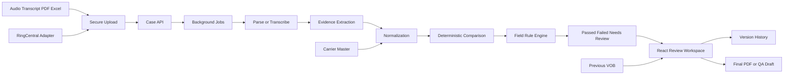

# US24 React VOB Automation — Master Index
## US24 Solutions — React VOB Automation Blueprint

**Document:** `00_README_AND_MASTER_INDEX.md`
**Document order:** 1 of 18
**Parent index:** [`00_README_AND_MASTER_INDEX.md`](./00_README_AND_MASTER_INDEX.md)
**Previous:** None — start here
**Next:** [`01_PRODUCT_VISION_SCOPE_AND_SUCCESS.md`](./01_PRODUCT_VISION_SCOPE_AND_SUCCESS.md)
**Project state:** Implementation-ready specification with named pending client decisions
**Prepared:** 2026-08-07

---

## Purpose

Provide the single entry point, document map, authority order, cross-document conventions, and delivery definition for the React-based US24 VOB automation platform.

## Direct dependencies

- All files in this package

## Authority and invariants

- Preserve source-derived facts and do not silently replace them with general assumptions.
- The client-supplied official VOB template controls the final report after sign-off.
- AI extracts evidence-backed candidates; deterministic rules calculate field and case outcomes.
- Original sources and original imported form values are immutable.
- Inline field highlighting is the primary error experience.
- PASSED, FAILED, and NEEDS REVIEW are the business outcomes.
- No visible login is included, but production still requires an approved controlled-access boundary.
- The final required, optional, conditional, and critical field matrix remains configurable.

## Source basis

- `US24_VOB_Generator_5.html` — current manual form, live preview, localStorage log, Excel export, and PDF generator.
- `VOB_SAMPLE (1).docx` — marked blank template and source for one-time/carrier-field observations.
- `VOB_CARSTEN_ACT_CIGNA ASH_08.04.26 (2).pdf` — completed sample VOB and official-style visual reference.
- `CARSTEN UHC (AARA) (2).txt` — noisy call transcript with IVR content, ASR errors, corrections, conflicts, and timestamps.
- `US24_VOB_Transcript_Verification_Enhancement_Blueprint.md` — earlier enhancement blueprint and locked workflow baseline.
- US24 meeting summary dated August 6, 2026.
- Official framework, vendor, security, and accessibility research is indexed in file 17.

---

## 1. How to use this package

- Read this file first and follow the numbered files in order for a complete product-to-engineering path.
- Use files 01 through 05 for product, information architecture, visual design, and screen implementation.
- Use files 06 through 10 for VOB rules, transcript processing, comparison, review, records, and carrier data.
- Use files 11 through 14 for frontend, backend, documents, security, privacy, and accessibility.
- Use files 15 and 16 for testing, release gates, phased execution, and AI coding-agent prompts.
- Use file 17 to verify research sources, architecture decisions, and unresolved client decisions.
- Every file links back to this index and names its previous and next document.
- Requirement identifiers must be preserved in tickets, tests, pull requests, and acceptance reports.
- When two documents appear to conflict, the authority hierarchy in this file decides which requirement wins.
- Never implement an assumption that this package explicitly labels as pending client approval.

## 2. Document map

- `00_README_AND_MASTER_INDEX.md` — US24 React VOB Automation — Master Index.
- `01_PRODUCT_VISION_SCOPE_AND_SUCCESS.md` — Product Vision, Scope, Users, and Success Measures.
- `02_SOURCE_ANALYSIS_AND_REQUIREMENTS_TRACEABILITY.md` — Source Analysis and Requirements Traceability.
- `03_INFORMATION_ARCHITECTURE_AND_USER_FLOWS.md` — Information Architecture and End-to-End User Flows.
- `04_UI_UX_DESIGN_SYSTEM.md` — UI/UX Design System and Interaction Standards.
- `05_SCREEN_SPECIFICATIONS_WORKSPACE.md` — Screen Specifications for the VOB Operations Workspace.
- `06_VOB_FORM_FIELD_ENGINE.md` — Canonical VOB Form and Field-Rule Engine.
- `07_TRANSCRIPT_AUDIO_UPLOAD_AND_PROCESSING.md` — Transcript, Document, Audio Upload, and Processing Pipeline.
- `08_EXTRACTION_NORMALIZATION_COMPARISON.md` — Evidence Extraction, Normalization, and Comparison Engine.
- `09_STATUS_INLINE_ERRORS_BYPASS_REVIEW.md` — Statuses, Inline Errors, Bypass, and Human Review.
- `10_RECORDS_HISTORY_CARRIER_MASTER.md` — Patient Records, Repeated VOB History, and Carrier Master.
- `11_REACT_FRONTEND_ARCHITECTURE.md` — React Frontend Architecture and Engineering Standards.
- `12_BACKEND_DATA_JOBS_AND_RINGCENTRAL.md` — Backend, Data, Background Jobs, and RingCentral Architecture.
- `13_PDF_EXCEL_IMPORT_EXPORT.md` — PDF and Excel Import, Mapping, Generation, and Export.
- `14_SECURITY_PRIVACY_ACCESSIBILITY.md` — Security, Privacy, Auditability, and Accessibility.
- `15_TESTING_ACCEPTANCE_AND_SAMPLE_CASES.md` — Testing Strategy, Acceptance Criteria, and Golden Sample Cases.
- `16_IMPLEMENTATION_PHASES_AND_AI_AGENT_PROMPTS.md` — Implementation Phases and AI Coding-Agent Prompts.
- `17_RESEARCH_SOURCES_AND_DECISION_LOG.md` — Research Sources, Architecture Decisions, and Open Questions.

## 3. Authority hierarchy

- The latest explicit client instruction has highest product authority.
- The August 6, 2026 meeting summary governs meeting-derived workflow requirements.
- The client-supplied official VOB template governs final document labels, ordering, and visual arrangement after sign-off.
- The completed sample PDF demonstrates current output expectations but does not prove every value is correct.
- The supplied call transcript is audit evidence and deliberately includes ambiguity that the product must surface.
- The current HTML prototype is a visual and field-coverage baseline, not a production architecture.
- This Markdown package governs the recommended React implementation unless the client approves a later change.
- Official vendor documentation governs current technical limits and integration behavior.
- Security and legal applicability must be confirmed by US24 counsel or compliance personnel; these files provide engineering controls, not legal advice.

## 4. Locked product contract

- Support two primary modes: transcript or audio to automatic VOB filling, and transcript or audio plus an already-filled VOB to field-level audit.
- Accept transcript inputs in TXT, DOCX, text-based PDF, CSV, Excel, and pasted-text form.
- Accept completed VOB inputs in PDF and Excel; identify image-only PDFs instead of pretending they are readable.
- Accept call recordings such as MP3 and other approved audio formats, with asynchronous transcription and visible progress.
- Use the client-supplied official blank VOB template as the authoritative final report format.
- Preserve the existing US24 navy, orange, off-white, card-based visual identity while substantially improving clarity and workflow.
- Show validation problems inside the affected field block with red or amber highlighting, not only in a detached error section.
- Use PASSED, FAILED, and NEEDS REVIEW as business outcomes; PROCESSING and DRAFT are workflow states rather than audit outcomes.
- Keep the original imported or entered form immutable and create corrected versions instead of silently overwriting the source.
- Treat AI as an evidence extractor; use deterministic field rules to decide matches, mismatches, requiredness, and final status.
- Remove irrelevant talk from extraction context while retaining the original transcript and timestamps for audit evidence.
- Support explicit bypass reasons for unavailable, irrelevant, or unverified fields; never use an untracked generic Ignore action.
- Create a patient-policy base record on the first VOB and dated verification versions on later calls.
- Track changing values such as deductible, out-of-pocket, visits, authorization, and eligibility without creating uncontrolled duplicates.
- Store reusable payer data in a versioned carrier master scoped by payer, plan, state, network, line of business, and effective period.
- Keep manual upload available even after a future RingCentral integration is introduced.
- Do not provide a user-facing login screen in version one; production deployment must still use an approved controlled-access boundary.
- Do not store sensitive production records in browser localStorage; the current localStorage behavior is prototype-only.
- Do not infer 100 percent coverage merely because copay and coinsurance are marked No.
- Keep the mandatory, optional, conditional, and critical field matrix configurable until US24 supplies the approved final matrix.
- Block a clean final PDF when a record is FAILED or unresolved; permit only a marked draft or QA report.
- Never treat filenames, caller assumptions, or isolated keywords as authoritative benefit facts.

## 5. End-to-end architecture

- The browser application uploads source files directly to private object storage through short-lived upload instructions.
- The API creates a verification case and immutable source artifacts.
- Background workers parse documents, transcode and transcribe audio, classify speakers, and extract structured facts.
- Every extracted fact retains source type, evidence text, timestamp or page location, confidence, and competing candidates.
- A deterministic comparison service normalizes form and transcript values using field-specific rules.
- The field-rule engine evaluates requiredness, conditional dependencies, bypass permissions, and criticality.
- The result service calculates field states and the overall PASSED, FAILED, or NEEDS REVIEW outcome.
- The React workspace renders the canonical form, original values, transcript evidence, inline issues, and PDF preview.
- Corrective actions create new revisions and never erase the original imported form.
- Final PDF generation is status-gated and uses the versioned client template.
- Records, verification versions, carrier masters, and audit events are stored server-side.
- RingCentral is an optional source adapter; manual upload remains a permanent fallback.

## 6. Architecture diagram

## 7. Reading paths by role

- Product owner path: 00, 01, 02, 03, 05, 09, 10, 15, and 16.
- UX designer path: 00, 03, 04, 05, 06, 09, 13, 14, and 15.
- React engineer path: 00, 03, 04, 05, 06, 09, 11, 13, 14, and 15.
- Backend engineer path: 00, 06, 07, 08, 10, 12, 13, 14, and 15.
- AI or extraction engineer path: 00, 02, 06, 07, 08, 09, 12, and 15.
- QA engineer path: 00, 02, 03, 05, 06, 08, 09, 13, 14, and 15.
- Implementation agent path: 00, then 16, then each dependency referenced by the active phase.

## 8. Requirement identifier convention

- Use `MTG-###` for requirements derived from the August 6 meeting summary.
- Use `CLT-###` for decisions explicitly confirmed by the client in chat.
- Use `TPL-###` for template-derived layout or field requirements.
- Use `CUR-###` for current HTML behavior that is intentionally preserved or removed.
- Use `CASE-###` for golden sample discrepancies and transcript edge cases.
- Use `UX-###` for user-interface and interaction requirements.
- Use `ENG-###` for architecture and implementation requirements.
- Use `SEC-###` for security, privacy, audit, and controlled-access requirements.
- Use `ACC-###` for accessibility requirements.
- Use `QA-###` for acceptance and regression tests.
- Each ticket must cite at least one requirement identifier.
- Each automated test name should include the most relevant identifier when practical.

## 9. Global definition of done

- Both automatic filling and form-audit modes work end to end with realistic non-empty demo data.
- Every supported source type has success, invalid, unsupported, oversized, retry, and cancellation states.
- The sample transcript and completed PDF produce the expected mismatches, conflicts, corrections, and unknown states.
- All VOB fields are rendered from a canonical field registry rather than separately hard-coded copies.
- Inline error blocks show entered value, supported value, evidence, reason, and permitted actions.
- No substantive field is silently defaulted to Yes, No, Current, In Network, PT, or 100 percent.
- Original artifacts and original form values remain immutable.
- Repeated calls create versions and show field-level differences.
- Carrier-master values are scoped and versioned rather than global unqualified defaults.
- The final PDF matches the signed-off template and does not create accidental blank pages.
- FAILED and unresolved NEEDS REVIEW records cannot generate an ordinary clean final PDF.
- The saved-record list exposes status, patient, payer, policy, date, version, issue count, and processing state.
- The application remains usable at desktop, laptop, tablet, and narrow responsive widths.
- Keyboard and screen-reader users can identify, navigate to, and resolve errors.
- Production records are stored server-side and uploads are validated at multiple layers.
- Background jobs are idempotent, retryable, observable, and safe to resume.
- All API and UI contracts have tests and generated or checked types.
- A release candidate passes unit, integration, E2E, accessibility, document, security, and golden-case gates.

## 10. Glossary

- VOB means Verification of Benefits.
- Canonical form means the normalized editable representation independent of the uploaded PDF or Excel layout.
- Source artifact means an uploaded audio, transcript, PDF, Excel file, or imported RingCentral recording.
- Evidence means the exact source passage, timestamp, page region, or master-data version supporting a value.
- Candidate means one possible extracted value before authority and conflict rules choose or escalate it.
- Field state means MATCH, MISMATCH, MISSING, CONFLICT, LOW CONFIDENCE, or another field-level result.
- Case status means the overall PASSED, FAILED, or NEEDS REVIEW result.
- Workflow state means DRAFT, UPLOADING, PROCESSING, READY, FINALIZED, or processing failure state.
- Bypass means a recorded exception with a controlled reason, note, and status consequence.
- Carrier master means reusable versioned payer or plan information.
- Base record means the patient-policy-service grouping that owns multiple dated VOB versions.
- Revision means a new corrected form snapshot derived from an immutable original.
- Critical false pass means the system incorrectly marks a materially wrong VOB as PASSED.
- Diarization means associating transcript segments with different speakers.
- TFL means timely filing limit.
- DOS means date of service.
- OOP means out-of-pocket amount.
- HSA, HRA, and HCA are account-related fields whose exact business use remains configurable.

## Implementation acceptance checklist

- [ ] AC-001 — Implementation: confirm `Read this file first and follow the numbered files in order for a complete product-to-engineering path` is implemented, demonstrated, or explicitly recorded as pending.
- [ ] AC-002 — Design review: confirm `Use files 01 through 05 for product, information architecture, visual design, and screen implementation` is implemented, demonstrated, or explicitly recorded as pending.
- [ ] AC-003 — Domain review: confirm `Use files 06 through 10 for VOB rules, transcript processing, comparison, review, records, and carrier data` is implemented, demonstrated, or explicitly recorded as pending.
- [ ] AC-004 — QA verification: confirm `Use files 11 through 14 for frontend, backend, documents, security, privacy, and accessibility` is implemented, demonstrated, or explicitly recorded as pending.
- [ ] AC-005 — Accessibility review: confirm `Use files 15 and 16 for testing, release gates, phased execution, and AI coding-agent prompts` is implemented, demonstrated, or explicitly recorded as pending.
- [ ] AC-006 — Security review: confirm `Use file 17 to verify research sources, architecture decisions, and unresolved client decisions` is implemented, demonstrated, or explicitly recorded as pending.
- [ ] AC-007 — Regression protection: confirm `Every file links back to this index and names its previous and next document` is implemented, demonstrated, or explicitly recorded as pending.
- [ ] AC-008 — Client acceptance: confirm `Requirement identifiers must be preserved in tickets, tests, pull requests, and acceptance reports` is implemented, demonstrated, or explicitly recorded as pending.
- [ ] AC-009 — Implementation: confirm `When two documents appear to conflict, the authority hierarchy in this file decides which requirement wins` is implemented, demonstrated, or explicitly recorded as pending.
- [ ] AC-010 — Design review: confirm `Never implement an assumption that this package explicitly labels as pending client approval` is implemented, demonstrated, or explicitly recorded as pending.
- [ ] AC-011 — Domain review: confirm ``00_README_AND_MASTER_INDEX.md` — US24 React VOB Automation — Master Index` is implemented, demonstrated, or explicitly recorded as pending.
- [ ] AC-012 — QA verification: confirm ``01_PRODUCT_VISION_SCOPE_AND_SUCCESS.md` — Product Vision, Scope, Users, and Success Measures` is implemented, demonstrated, or explicitly recorded as pending.
- [ ] AC-013 — Accessibility review: confirm ``02_SOURCE_ANALYSIS_AND_REQUIREMENTS_TRACEABILITY.md` — Source Analysis and Requirements Traceability` is implemented, demonstrated, or explicitly recorded as pending.
- [ ] AC-014 — Security review: confirm ``03_INFORMATION_ARCHITECTURE_AND_USER_FLOWS.md` — Information Architecture and End-to-End User Flows` is implemented, demonstrated, or explicitly recorded as pending.
- [ ] AC-015 — Regression protection: confirm ``04_UI_UX_DESIGN_SYSTEM.md` — UI/UX Design System and Interaction Standards` is implemented, demonstrated, or explicitly recorded as pending.
- [ ] AC-016 — Client acceptance: confirm ``05_SCREEN_SPECIFICATIONS_WORKSPACE.md` — Screen Specifications for the VOB Operations Workspace` is implemented, demonstrated, or explicitly recorded as pending.
- [ ] AC-017 — Implementation: confirm ``06_VOB_FORM_FIELD_ENGINE.md` — Canonical VOB Form and Field-Rule Engine` is implemented, demonstrated, or explicitly recorded as pending.
- [ ] AC-018 — Design review: confirm ``07_TRANSCRIPT_AUDIO_UPLOAD_AND_PROCESSING.md` — Transcript, Document, Audio Upload, and Processing Pipeline` is implemented, demonstrated, or explicitly recorded as pending.
- [ ] AC-019 — Domain review: confirm ``08_EXTRACTION_NORMALIZATION_COMPARISON.md` — Evidence Extraction, Normalization, and Comparison Engine` is implemented, demonstrated, or explicitly recorded as pending.
- [ ] AC-020 — QA verification: confirm ``09_STATUS_INLINE_ERRORS_BYPASS_REVIEW.md` — Statuses, Inline Errors, Bypass, and Human Review` is implemented, demonstrated, or explicitly recorded as pending.
- [ ] AC-021 — Accessibility review: confirm ``10_RECORDS_HISTORY_CARRIER_MASTER.md` — Patient Records, Repeated VOB History, and Carrier Master` is implemented, demonstrated, or explicitly recorded as pending.
- [ ] AC-022 — Security review: confirm ``11_REACT_FRONTEND_ARCHITECTURE.md` — React Frontend Architecture and Engineering Standards` is implemented, demonstrated, or explicitly recorded as pending.
- [ ] AC-023 — Regression protection: confirm ``12_BACKEND_DATA_JOBS_AND_RINGCENTRAL.md` — Backend, Data, Background Jobs, and RingCentral Architecture` is implemented, demonstrated, or explicitly recorded as pending.
- [ ] AC-024 — Client acceptance: confirm ``13_PDF_EXCEL_IMPORT_EXPORT.md` — PDF and Excel Import, Mapping, Generation, and Export` is implemented, demonstrated, or explicitly recorded as pending.
- [ ] AC-025 — Implementation: confirm ``14_SECURITY_PRIVACY_ACCESSIBILITY.md` — Security, Privacy, Auditability, and Accessibility` is implemented, demonstrated, or explicitly recorded as pending.
- [ ] AC-026 — Design review: confirm ``15_TESTING_ACCEPTANCE_AND_SAMPLE_CASES.md` — Testing Strategy, Acceptance Criteria, and Golden Sample Cases` is implemented, demonstrated, or explicitly recorded as pending.
- [ ] AC-027 — Domain review: confirm ``16_IMPLEMENTATION_PHASES_AND_AI_AGENT_PROMPTS.md` — Implementation Phases and AI Coding-Agent Prompts` is implemented, demonstrated, or explicitly recorded as pending.
- [ ] AC-028 — QA verification: confirm ``17_RESEARCH_SOURCES_AND_DECISION_LOG.md` — Research Sources, Architecture Decisions, and Open Questions` is implemented, demonstrated, or explicitly recorded as pending.
- [ ] AC-029 — Accessibility review: confirm `The latest explicit client instruction has highest product authority` is implemented, demonstrated, or explicitly recorded as pending.
- [ ] AC-030 — Security review: confirm `The August 6, 2026 meeting summary governs meeting-derived workflow requirements` is implemented, demonstrated, or explicitly recorded as pending.
- [ ] AC-031 — Regression protection: confirm `The client-supplied official VOB template governs final document labels, ordering, and visual arrangement after sign-off` is implemented, demonstrated, or explicitly recorded as pending.
- [ ] AC-032 — Client acceptance: confirm `The completed sample PDF demonstrates current output expectations but does not prove every value is correct` is implemented, demonstrated, or explicitly recorded as pending.
- [ ] AC-033 — Implementation: confirm `The supplied call transcript is audit evidence and deliberately includes ambiguity that the product must surface` is implemented, demonstrated, or explicitly recorded as pending.
- [ ] AC-034 — Design review: confirm `The current HTML prototype is a visual and field-coverage baseline, not a production architecture` is implemented, demonstrated, or explicitly recorded as pending.
- [ ] AC-035 — Domain review: confirm `This Markdown package governs the recommended React implementation unless the client approves a later change` is implemented, demonstrated, or explicitly recorded as pending.
- [ ] AC-036 — QA verification: confirm `Official vendor documentation governs current technical limits and integration behavior` is implemented, demonstrated, or explicitly recorded as pending.
- [ ] AC-037 — Accessibility review: confirm `Security and legal applicability must be confirmed by US24 counsel or compliance personnel; these files provide engineering controls, not legal advice` is implemented, demonstrated, or explicitly recorded as pending.
- [ ] AC-038 — Security review: confirm `Support two primary modes: transcript or audio to automatic VOB filling, and transcript or audio plus an already-filled VOB to field-level audit` is implemented, demonstrated, or explicitly recorded as pending.
- [ ] AC-039 — Regression protection: confirm `Accept transcript inputs in TXT, DOCX, text-based PDF, CSV, Excel, and pasted-text form` is implemented, demonstrated, or explicitly recorded as pending.
- [ ] AC-040 — Client acceptance: confirm `Accept call recordings such as MP3 and other approved audio formats, with asynchronous transcription and visible progress` is implemented, demonstrated, or explicitly recorded as pending.
- [ ] AC-041 — Implementation: confirm `Use the client-supplied official blank VOB template as the authoritative final report format` is implemented, demonstrated, or explicitly recorded as pending.
- [ ] AC-042 — Design review: confirm `Preserve the existing US24 navy, orange, off-white, card-based visual identity while substantially improving clarity and workflow` is implemented, demonstrated, or explicitly recorded as pending.
- [ ] AC-043 — Domain review: confirm `Show validation problems inside the affected field block with red or amber highlighting, not only in a detached error section` is implemented, demonstrated, or explicitly recorded as pending.
- [ ] AC-044 — QA verification: confirm `Use PASSED, FAILED, and NEEDS REVIEW as business outcomes; PROCESSING and DRAFT are workflow states rather than audit outcomes` is implemented, demonstrated, or explicitly recorded as pending.
- [ ] AC-045 — Accessibility review: confirm `Keep the original imported or entered form immutable and create corrected versions instead of silently overwriting the source` is implemented, demonstrated, or explicitly recorded as pending.
- [ ] AC-046 — Security review: confirm `Treat AI as an evidence extractor; use deterministic field rules to decide matches, mismatches, requiredness, and final status` is implemented, demonstrated, or explicitly recorded as pending.
- [ ] AC-047 — Regression protection: confirm `Remove irrelevant talk from extraction context while retaining the original transcript and timestamps for audit evidence` is implemented, demonstrated, or explicitly recorded as pending.
- [ ] AC-048 — Client acceptance: confirm `Support explicit bypass reasons for unavailable, irrelevant, or unverified fields; never use an untracked generic Ignore action` is implemented, demonstrated, or explicitly recorded as pending.
- [ ] AC-049 — Implementation: confirm `Create a patient-policy base record on the first VOB and dated verification versions on later calls` is implemented, demonstrated, or explicitly recorded as pending.
- [ ] AC-050 — Design review: confirm `Track changing values such as deductible, out-of-pocket, visits, authorization, and eligibility without creating uncontrolled duplicates` is implemented, demonstrated, or explicitly recorded as pending.
- [ ] AC-051 — Domain review: confirm `Store reusable payer data in a versioned carrier master scoped by payer, plan, state, network, line of business, and effective period` is implemented, demonstrated, or explicitly recorded as pending.
- [ ] AC-052 — QA verification: confirm `Keep manual upload available even after a future RingCentral integration is introduced` is implemented, demonstrated, or explicitly recorded as pending.
- [ ] AC-053 — Accessibility review: confirm `Do not infer 100 percent coverage merely because copay and coinsurance are marked No` is implemented, demonstrated, or explicitly recorded as pending.
- [ ] AC-054 — Security review: confirm `Keep the mandatory, optional, conditional, and critical field matrix configurable until US24 supplies the approved final matrix` is implemented, demonstrated, or explicitly recorded as pending.
- [ ] AC-055 — Regression protection: confirm `Never treat filenames, caller assumptions, or isolated keywords as authoritative benefit facts` is implemented, demonstrated, or explicitly recorded as pending.
- [ ] AC-056 — Client acceptance: confirm `The browser application uploads source files directly to private object storage through short-lived upload instructions` is implemented, demonstrated, or explicitly recorded as pending.
- [ ] AC-057 — Implementation: confirm `The API creates a verification case and immutable source artifacts` is implemented, demonstrated, or explicitly recorded as pending.
- [ ] AC-058 — Design review: confirm `Background workers parse documents, transcode and transcribe audio, classify speakers, and extract structured facts` is implemented, demonstrated, or explicitly recorded as pending.
- [ ] AC-059 — Domain review: confirm `Every extracted fact retains source type, evidence text, timestamp or page location, confidence, and competing candidates` is implemented, demonstrated, or explicitly recorded as pending.
- [ ] AC-060 — QA verification: confirm `A deterministic comparison service normalizes form and transcript values using field-specific rules` is implemented, demonstrated, or explicitly recorded as pending.
- [ ] AC-061 — Accessibility review: confirm `The field-rule engine evaluates requiredness, conditional dependencies, bypass permissions, and criticality` is implemented, demonstrated, or explicitly recorded as pending.
- [ ] AC-062 — Security review: confirm `The result service calculates field states and the overall PASSED, FAILED, or NEEDS REVIEW outcome` is implemented, demonstrated, or explicitly recorded as pending.
- [ ] AC-063 — Regression protection: confirm `The React workspace renders the canonical form, original values, transcript evidence, inline issues, and PDF preview` is implemented, demonstrated, or explicitly recorded as pending.
- [ ] AC-064 — Client acceptance: confirm `Corrective actions create new revisions and never erase the original imported form` is implemented, demonstrated, or explicitly recorded as pending.
- [ ] AC-065 — Implementation: confirm `Final PDF generation is status-gated and uses the versioned client template` is implemented, demonstrated, or explicitly recorded as pending.
- [ ] AC-066 — Design review: confirm `Records, verification versions, carrier masters, and audit events are stored server-side` is implemented, demonstrated, or explicitly recorded as pending.
- [ ] AC-067 — Domain review: confirm `A[Audio Transcript PDF Excel] --> B[Secure Upload]` is implemented, demonstrated, or explicitly recorded as pending.
- [ ] AC-068 — QA verification: confirm `B --> C[Case API]` is implemented, demonstrated, or explicitly recorded as pending.
- [ ] AC-069 — Accessibility review: confirm `C --> D[Background Jobs]` is implemented, demonstrated, or explicitly recorded as pending.
- [ ] AC-070 — Security review: confirm `D --> E[Parse or Transcribe]` is implemented, demonstrated, or explicitly recorded as pending.
- [ ] AC-071 — Regression protection: confirm `E --> F[Evidence Extraction]` is implemented, demonstrated, or explicitly recorded as pending.
- [ ] AC-072 — Client acceptance: confirm `F --> G[Normalization]` is implemented, demonstrated, or explicitly recorded as pending.
- [ ] AC-073 — Implementation: confirm `G --> H[Deterministic Comparison]` is implemented, demonstrated, or explicitly recorded as pending.
- [ ] AC-074 — Design review: confirm `H --> I[Field Rule Engine]` is implemented, demonstrated, or explicitly recorded as pending.
- [ ] AC-075 — Domain review: confirm `I --> J[Passed Failed Needs Review]` is implemented, demonstrated, or explicitly recorded as pending.
- [ ] AC-076 — QA verification: confirm `J --> K[React Review Workspace]` is implemented, demonstrated, or explicitly recorded as pending.
- [ ] AC-077 — Accessibility review: confirm `K --> L[Version History]` is implemented, demonstrated, or explicitly recorded as pending.
- [ ] AC-078 — Security review: confirm `K --> M[Final PDF or QA Draft]` is implemented, demonstrated, or explicitly recorded as pending.
**End of document — exactly 300 lines.**
